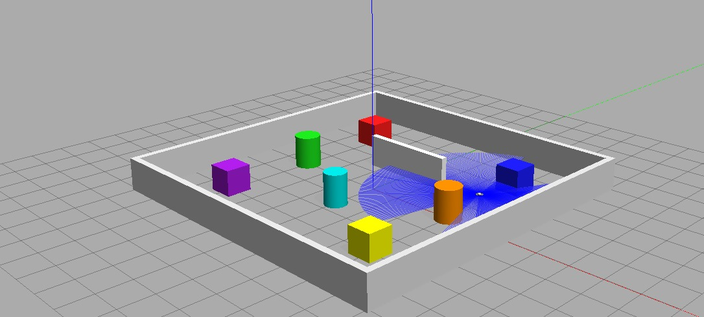
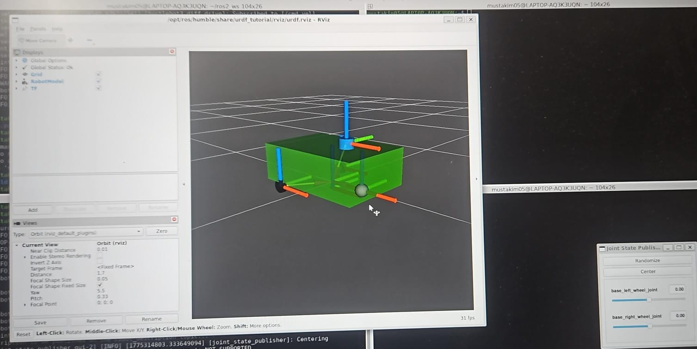
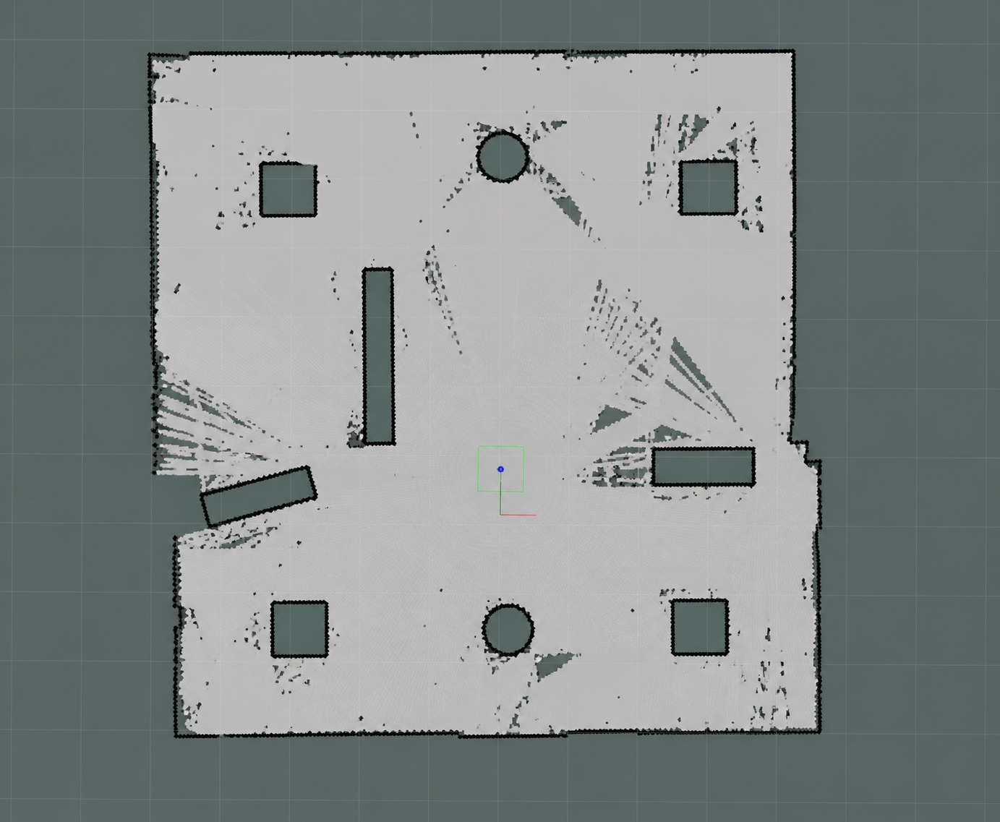
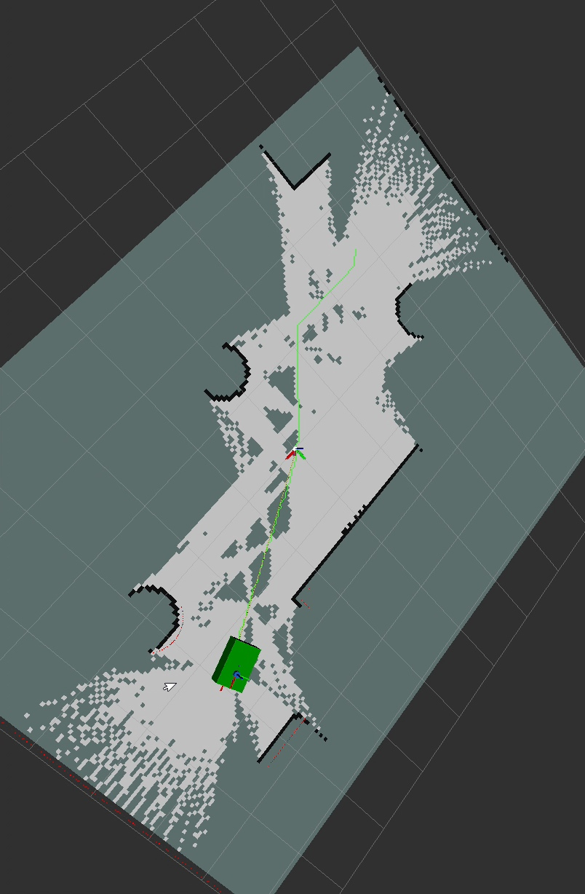
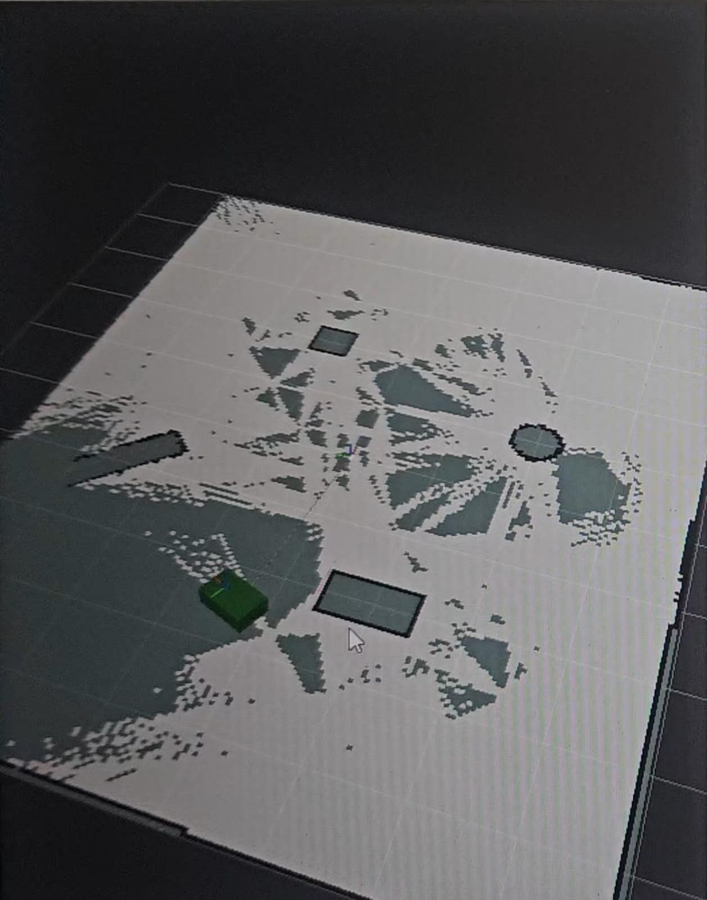
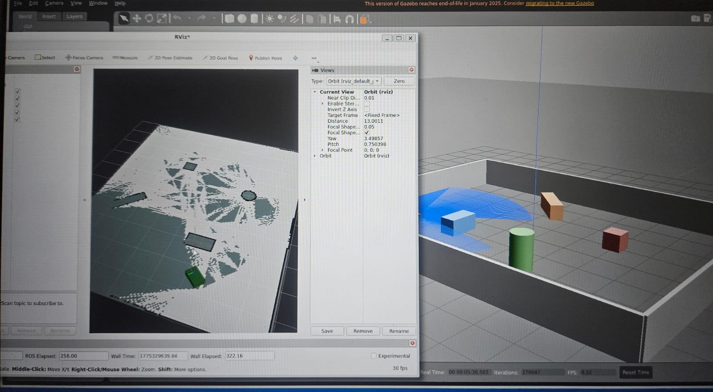

# 🤖 destination_bot — A* Path Planning on ROS2

> A custom differential drive robot built from scratch in ROS2,
> capable of mapping an environment using SLAM and finding the 
> shortest path between two points using the A* algorithm.



---

## 📌 Table of Contents

- [What is this project?](#what-is-this-project)
- [How ROS2 Works](#how-ros2-works)
- [How the Robot URDF is Made](#how-the-robot-urdf-is-made)
- [How SLAM Works](#how-slam-works)
- [How A* Algorithm Works](#how-a-algorithm-works)
- [Project Structure](#project-structure)
- [Installation](#installation)
- [Running the Simulation](#running-the-simulation)
- [Results](#results)
- [Author](#author)

---

## 🧠 What is this project?

This project simulates a complete autonomous robot navigation
pipeline entirely in software — no real hardware needed.

The robot:
1. Spawns inside a custom Gazebo world full of obstacles
2. Drives around and builds a map using SLAM
3. Uses A* algorithm to find shortest path between any two points
4. Visualizes everything live in RViz

Think of it like Google Maps — but for a robot in a room 🗺️

### Pipeline Overview

```
Custom URDF → Gazebo Sim → SLAM Mapping → Save Map → A* Planning → RViz Visualization
```

---

## 🌐 How ROS2 Works

> ROS2 (Robot Operating System 2) is not actually an OS.
> It is a middleware framework — a set of tools and libraries
> that help different parts of a robot talk to each other.

### Core Concepts

#### 1. Nodes
A node is a single program that does one job.
In this project we have nodes for:
- Publishing the robot model
- Reading the lidar sensor
- Building the SLAM map
- Running the A* algorithm
- Controlling the robot with a keyboard

```
[keyboard node] ──cmd_vel──→ [robot]
[lidar node]    ──scan──────→ [slam node] ──map──→ [astar node]
```

#### 2. Topics
Nodes talk to each other through topics.
A topic is like a radio channel — one node broadcasts,
others listen.

| Topic | What it carries | Publisher | Subscriber |
|-------|----------------|-----------|------------|
| `/cmd_vel` | Velocity commands | keyboard node | robot |
| `/scan` | Lidar distance data | Gazebo lidar | SLAM node |
| `/map` | Occupancy grid map | SLAM node | A* node |
| `/odom` | Robot position | Gazebo | SLAM node |
| `/astar_path` | Planned path | A* node | RViz |

#### 3. Launch Files
Instead of running 10 nodes manually, a launch file
starts them all with one command:
```bash
ros2 launch my_robot gazebo.launch.py
```

#### 4. TF Tree (Transform Tree)
ROS2 keeps track of where every part of the robot is
in 3D space using a tree of coordinate frames:
```
map
 └── odom
      └── base_footprint
               └── base_link
                     ├── left_wheel
                     ├── right_wheel
                     ├── front_caster
                     └── lidar_link
```

---

## 🔩 How the Robot URDF is Made

> URDF (Unified Robot Description Format) is an XML file
> that describes what the robot looks like and how its
> parts connect and move.

### Robot Design

Our robot is a differential drive robot — like a TurtleBot.
It has:
- A rectangular chassis (the body)
- Two driven wheels (left and right)
- One passive caster wheel (front support)
- A 2D lidar sensor on top



### URDF Building Blocks

#### 1. Links (Rigid Parts)
A link is a physical part of the robot with shape,
color, collision and weight:

```xml
<link name="base_link">
  <visual>
    <!-- What it looks like -->
    <geometry>
      <box size="0.6 0.4 0.2"/>
    </geometry>
    <material name="green"/>
  </visual>
  <collision>
    <!-- What Gazebo uses for physics -->
    <geometry>
      <box size="0.6 0.4 0.2"/>
    </geometry>
  </collision>
  <inertial>
    <!-- Weight and center of gravity -->
    <mass value="1.5"/>
    <inertia ixx="0.013" ixy="0" ixz="0"
             iyy="0.021" iyz="0"
             izz="0.026"/>
  </inertial>
</link>
```

#### 2. Joints (Connections Between Parts)
A joint connects two links and defines how they move:

| Joint Type | Movement | Used For |
|-----------|----------|---------|
| `fixed` | No movement | Lidar, caster mount |
| `continuous` | Rotates freely | Wheels |
| `revolute` | Rotates with limits | Robotic arms |

```xml
<!-- Wheel joint — rotates continuously -->
<joint name="left_wheel_joint" type="continuous">
  <parent link="base_link"/>
  <child  link="left_wheel"/>
  <origin xyz="-0.15 0.225 0" rpy="0 0 0"/>
  <axis xyz="0 1 0"/>
</joint>
```

#### 3. Xacro (Smart URDF)
Xacro lets us use variables and macros so we don't
repeat the same code for left and right wheels:

```xml
<!-- Define once -->
<xacro:macro name="wheel" params="name y_reflect">
  <link name="${name}_wheel">
    ...
  </link>
  <joint name="${name}_wheel_joint" type="continuous">
    <origin xyz="0 ${y_reflect * 0.225} 0"/>
  </joint>
</xacro:macro>

<!-- Use twice — no copy paste! -->
<xacro:wheel name="left"  y_reflect=" 1"/>
<xacro:wheel name="right" y_reflect="-1"/>
```

#### 4. Gazebo Plugins
Plugins give the robot actual behavior in simulation:

```xml
<!-- Makes robot respond to /cmd_vel velocity commands -->
<plugin name="diff_drive" filename="libgazebo_ros_diff_drive.so">
  <left_joint>base_left_wheel_joint</left_joint>
  <right_joint>base_right_wheel_joint</right_joint>
  <wheel_separation>0.455</wheel_separation>
  <wheel_diameter>0.07</wheel_diameter>
</plugin>
```

---

## 🗺️ How SLAM Works

> SLAM = Simultaneous Localization And Mapping
> The robot builds a map AND figures out where it
> is on that map — at the same time.

### The Problem SLAM Solves
Imagine you wake up in a dark room. You walk around
with a flashlight. You slowly build a mental picture
of the room while also tracking where you are.
That's exactly what SLAM does.

### How It Works Step by Step

```
1. Robot moves → wheels turn
2. Odometry counts wheel rotations → estimates position
3. Lidar fires 360 laser beams → measures distances to walls
4. SLAM Toolbox compares new scan to previous scans
5. Corrects position estimate (loop closure)
6. Adds new areas to the occupancy grid map
7. Repeat every 100ms
```

### Occupancy Grid Map
The output of SLAM is a grid where every cell is:
- **White** = free space (robot can go here)
- **Black** = obstacle (wall or object)
- **Grey** = unknown (not yet explored)



---

## ⭐ How A* Algorithm Works

> A* (A-Star) is a pathfinding algorithm that finds
> the shortest path between two points while avoiding
> obstacles. It is used in Google Maps, video games,
> and robotics.

### The Core Idea

A* explores the map by always choosing the next cell
that looks most promising — using a score:

```
f(n) = g(n) + h(n)

g(n) = actual cost from start to current cell
h(n) = estimated cost from current cell to goal
       (heuristic — we use Euclidean distance)
f(n) = total estimated cost of path through this cell
```

### Step by Step Visualization

```
S = Start    G = Goal    # = Obstacle    . = Explored    * = Final Path

┌─────────────────┐
│ S . . . . . . . │
│ . . # # # . . . │
│ . . # . . . . . │
│ . . # . # # . . │
│ . . . . # . . . │
│ . . . . . * * G │
└─────────────────┘
```

### A* in Our Code

```python
def astar(self, start, goal):
    open_heap = [(0.0, start)]      # priority queue
    came_from = {start: None}       # track path
    g_score   = {start: 0.0}       # cost so far

    while open_heap:
        _, current = heapq.heappop(open_heap)

        # Reached the goal!
        if current == goal:
            return self.reconstruct_path(came_from, current)

        # Check all 8 neighbors
        for neighbor, cost in self.get_neighbors(current):
            new_g = g_score[current] + cost

            if neighbor not in g_score or new_g < g_score[neighbor]:
                g_score[neighbor] = new_g
                # h = straight line distance to goal
                h = math.hypot(neighbor[0]-goal[0],
                               neighbor[1]-goal[1])
                heapq.heappush(open_heap, (new_g + h, neighbor))
                came_from[neighbor] = current

    return None  # No path found
```



---

## 📁 Project Structure

```
my_robot/
│
├── urdf/
│   └── my_robot.urdf.xacro      # Robot description
│
├── launch/
│   ├── gazebo.launch.py          # Start Gazebo + spawn robot
│   ├── slam.launch.py            # Start SLAM + RViz
│   ├── display.launch.py         # Preview robot in RViz only
│   └── navigation.launch.py      # Nav2 + A* node
│
├── worlds/
│   └── simple_world.sdf          # Custom obstacle world
│
├── config/
│   ├── slam_params.yaml          # SLAM Toolbox settings
│   └── nav2_params.yaml          # Nav2 settings
│
├── maps/
│   ├── my_map.pgm                # Saved map image
│   └── my_map.yaml               # Map metadata
│
├── scripts/
│   ├── astar_planner.py          # A* algorithm node
│   ├── easy_keyboard.py          # WASD keyboard controller
│   ├── autonomous_explorer.py    # Self-driving explorer
│   └── goal_navigator.py         # Goal-point navigator
│
├── CMakeLists.txt
├── package.xml
└── README.md
```

---

## 💻 Installation

### 1. Install ROS2 Humble

Follow the official guide:
```
https://docs.ros.org/en/humble/Installation/Ubuntu-Install-Debs.html
```

Or quick install:
```bash
sudo apt update && sudo apt install -y \
  software-properties-common
sudo add-apt-repository universe

sudo apt update && sudo apt install curl -y
sudo curl -sSL https://raw.githubusercontent.com/ros/rosdistro/master/ros.key \
  -o /usr/share/keyrings/ros-archive-keyring.gpg

echo "deb [arch=$(dpkg --print-architecture) \
  signed-by=/usr/share/keyrings/ros-archive-keyring.gpg] \
  http://packages.ros.org/ros2/ubuntu \
  $(. /etc/os-release && echo $UBUNTU_CODENAME) main" | \
  sudo tee /etc/apt/sources.list.d/ros2.list > /dev/null

sudo apt update
sudo apt install ros-humble-desktop -y
```

### 2. Install Gazebo + RViz + All Dependencies

```bash
sudo apt update && sudo apt install -y \
  ros-humble-gazebo-ros-pkgs \
  ros-humble-gazebo-ros2-control \
  ros-humble-slam-toolbox \
  ros-humble-nav2-bringup \
  ros-humble-navigation2 \
  ros-humble-nav2-map-server \
  ros-humble-robot-state-publisher \
  ros-humble-joint-state-publisher \
  ros-humble-joint-state-publisher-gui \
  ros-humble-xacro \
  ros-humble-tf2-tools \
  ros-humble-teleop-twist-keyboard \
  python3-colcon-common-extensions \
  python3-rosdep
```

### 3. Source ROS2 (add to ~/.bashrc so it runs automatically)

```bash
echo "source /opt/ros/humble/setup.bash" >> ~/.bashrc
source ~/.bashrc
```

### 4. Create Workspace and Clone

```bash
mkdir -p ~/ros2_ws/src
cd ~/ros2_ws/src
git clone https://github.com/Seikh05/destination_bot.git my_robot
```

### 5. Build

```bash
cd ~/ros2_ws
colcon build --symlink-install --packages-select my_robot
source install/setup.bash
```

---

## 🚀 Running the Simulation

> Open each step in a NEW terminal.
> Run `source ~/ros2_ws/install/setup.bash` in every terminal.

### Phase 1 — Launch Gazebo World

```bash
# Terminal 1
source ~/ros2_ws/install/setup.bash
ros2 launch my_robot gazebo.launch.py
```

You should see Gazebo open with the robot and obstacles.


---

### Phase 2 — Launch SLAM + RViz

```bash
# Terminal 2
source ~/ros2_ws/install/setup.bash
ros2 launch my_robot slam.launch.py
```

RViz opens. Add these displays:
- `Map` → topic: `/map`
- `LaserScan` → topic: `/scan`
- `RobotModel`
- `TF`



---

### Phase 3 — Drive the Robot to Build the Map

#### Option A — Easy keyboard (recommended)
```bash
# Terminal 3
source ~/ros2_ws/install/setup.bash
ros2 run my_robot easy_keyboard.py
```

| Key | Action |
|-----|--------|
| `W` | Forward |
| `S` | Backward |
| `A` | Turn Left |
| `D` | Turn Right |
| `Q` | Spin Left |
| `E` | Spin Right |
| `SPACE` | Stop |
| `+` | Speed Up |
| `-` | Slow Down |
| `X` | Quit |

#### Option B — Autonomous explorer
```bash
# Terminal 3
source ~/ros2_ws/install/setup.bash
ros2 run my_robot autonomous_explorer.py
```
Robot drives itself and maps automatically.

---

### Phase 4 — Save the Map

When the map looks complete in RViz:

```bash
# Terminal 4
source ~/ros2_ws/install/setup.bash
ros2 run nav2_map_server map_saver_cli \
  -f ~/ros2_ws/src/my_robot/maps/my_map
```

Two files are created:
```
my_map.pgm   ← map image
my_map.yaml  ← map settings
```

---

### Phase 5 — Run A* Pathfinding

```bash
# Terminal 3 (stop explorer first with Ctrl+C)
source ~/ros2_ws/install/setup.bash
ros2 run my_robot astar_planner.py
```

---

### Phase 6 — Set Start and Goal Points

```bash
# Terminal 4 — Set START point
ros2 topic pub --once /start_point geometry_msgs/msg/PoseStamped \
"{header: {frame_id: 'map'}, pose: {position: {x: 0.0, y: 0.0, z: 0.0}, orientation: {w: 1.0}}}"

# Terminal 4 — Set GOAL point
ros2 topic pub --once /goal_point geometry_msgs/msg/PoseStamped \
"{header: {frame_id: 'map'}, pose: {position: {x: 4.0, y: 4.0, z: 0.0}, orientation: {w: 1.0}}}"
```

In RViz add:
```
Add → Path → Topic: /astar_path
```

You will see the green path drawn on the map!


---

### Test Point Pairs for A*

| Test | Start | Goal | Difficulty |
|------|-------|------|------------|
| 1 | `0.0, 0.0` | `4.0, 4.0` | Easy |
| 2 | `-4.0, 0.0` | `4.0, 0.0` | Medium |
| 3 | `0.0, -3.0` | `0.0, 4.0` | Medium |
| 4 | `-4.0, -4.0` | `4.0, 4.0` | Hard |
| 5 | `0.0, -4.0` | `-4.0, 4.0` | Hard |

---

### Useful Debug Commands

```bash
# See all active topics
ros2 topic list

# Check lidar is publishing
ros2 topic hz /scan

# Check map is being built
ros2 topic hz /map

# View TF tree (save as PDF)
ros2 run tf2_tools view_frames
xdg-open frames.pdf

# Check robot is receiving velocity commands
ros2 topic echo /cmd_vel
```

---

## 📸 Results

### Robot in Gazebo


### SLAM Map Building


### A* Path Found


### RViz Full View


---

## 🛠️ Troubleshooting

| Problem | Fix |
|---------|-----|
| `No executable found` | Run `chmod +x scripts/*.py` then rebuild |
| Robot not moving | Check `ros2 topic echo /cmd_vel` |
| SLAM map not building | Check `/scan` and `/odom` are publishing |
| A* returns no path | Pick coordinates not inside obstacles |
| Gazebo spawn fails | Wait longer — add `TimerAction(period=5.0)` |
| RViz shows nothing | Set Fixed Frame to `map`, add displays manually |
| `source` not found | Run from `~/ros2_ws` not inside `src/my_robot` |

---

## 📦 Dependencies Summary

| Package | Purpose |
|---------|---------|
| `ros-humble-gazebo-ros-pkgs` | Gazebo + ROS2 bridge |
| `ros-humble-slam-toolbox` | SLAM mapping |
| `ros-humble-nav2-bringup` | Navigation stack |
| `ros-humble-xacro` | Smart URDF processing |
| `ros-humble-robot-state-publisher` | Publish robot TF |
| `ros-humble-tf2-tools` | Debug TF tree |

---

## 👤 Author

**Seikh Mustakim**
ROS2 Robotics Developer
PMEC Robotics Club (Research and Innovation Wing 🤖)

[](https://github.com/Seikh05)

---

## 📄 License

MIT License — free to use, modify and share.

---
